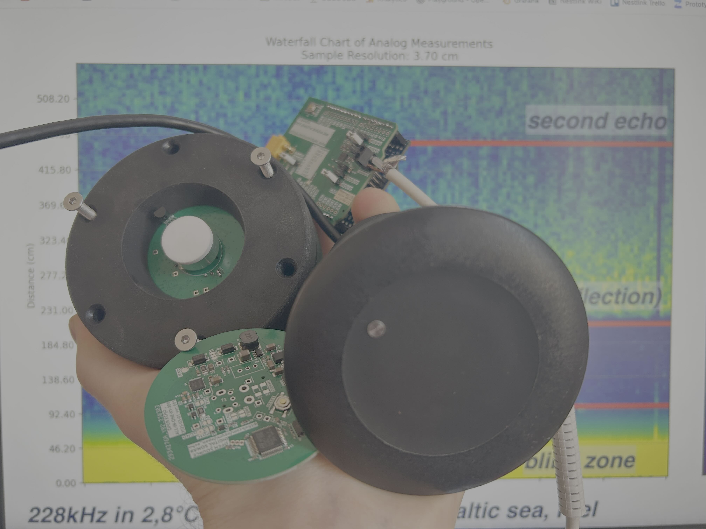
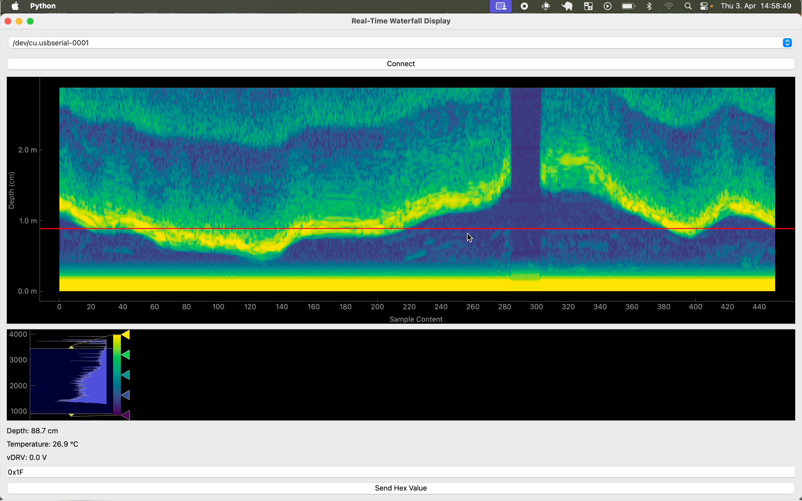

# Universal open-source sonar development stack 

An ongoing open-source software and hardware project about building a sonar for testing, boating, bathymetry and research.
Current hardware can drive a variety of commercial and DIY transducers and read RAW and interpreted distance/depth data. A python software interface lets you connect to Open Echo boards and read data and change settings.

### Currently in development. The TUSS4470 development shield is ready for external use already! Change happens constantly! The documentation is a bit behind.

Want to stay updated or participate? Join my [Discord](https://discord.com/invite/rerCyqAcrw)!

# Current state
- new All-In-One board with STM32, TUSS4470 and boost converter currently in testing
- a new NMEA-capable, universal echo sounder board in development
- partially reverse-engineered "LUCKY Fish Finder"
- read raw data from Lucky Fish Finder to Arduino
- plot data in a waterfall chart using Matplotlib + Python
- DIY transducer built and tested (works)
- TUSS4470 board built and tested (works)
- TUSS4470 Arduino code example done
- TUSS4470 hardware changed to support transformers to drive higher voltage piezos (like 200kHz for underwater)
- in water tests successful! (only tested up to 8m range to ground, but at least 25m were possible with Raymarine CPT-S without transformer in a horizontal test)

The LUCKY fishfinder with a DIY transducer (or stock) RAW amplifier (echo) data can be read using an Arduino, and data can be displayed using Matplotlib + Python. 

The new (January 2025) [TUSS4470 board](TUSS4470_shield_002/) is now able to use transducers (40kHz and 200kHz tested), drive them, receive echos, filter the signal and send the RAW echo data to the (same) Python backend. For good results, use a high input voltage like 25V DC on the XT30 connector.

This new [All-In-One Board](development/TUSS4470_PCB_ECHO) is currently in testing and works 90%. It runs on an STM32F103C8, TUSS4470 and MT3608 boost converter. The next board will be a universal transducer compatible (like Raymarine CPT-S, P19 etc), driver board with NMEA2000 + NMEA0183 and additional USB RAW output.

The [LUCKY fishfinder hack](reverse_engineering/) is pretty much obsolte and replaced by the TUSS4470 board. If you want to play with custom sonar, use this!

--------
# TUSS4470 Ultrasonic Transducer Driver Arduino Board
This [PCB-board](TUSS4470_shield_002/TUSS4470_shield_hardware) is an Arduino (Uno) compatible board to test the Texas Instruments TUSS4470 Ultrasonic driver IC. The provided example [Arduino UNO code](TUSS4470_shield_002/TUSS4470_arduino/TUSS4470_shield/TUSS4470_shield.ino) lets you drive a 40kHz transducer, apply noise filtering, and send the echo via Serial to the [Python backend](TUSS4470_shield_002/live_waterfall_python/live_waterfall.py). You can change the code to your needs (i.e. to use other frequencies, sample sizes, speed etc.). The Arduino UNO clock speed and RAM size limit the sampling speed to a resolution of ca. 1-2cm in air and 4cm (ca. 13uS/sample) under water and to ca. 850 Samples. An Arduino MEGA should solve this issue partially.

TUSS4470 Arduino Shield:

The TUSS4470 works as follows:
After initial setup, a burst of 8 pulses in drive frequency is sent to the TUSS4470 by the Arduino on PIN9. The TUSS4470 sends this pulse to the transducer then waits. The Transducer sends this pulse out as a short pulse of sound. Echos reflected by obstacles bounce back to the transducer and excite a voltage in it. The TUSS4470 measures that voltage, filters it, amplifies it and sends it to the A0 pin of the Arduino. By reading this amplified voltage, an (or multiple) obstacles can be detected. The Python script plots this data in a waterfall diagram.

DIY transducer assembly with 1:6 transformer and 228kHz transducer for water:

# Python PyQT Software
There are firmware examples in each project folder. 
A [Python PyQT interface](/TUSS4470_shield_002/live_waterfall_python/live_waterfall_settings.py) allows you to control the Open Echo boards, view live data, and adjust board settings.

Live echogram in water on Python Software (6x speed):

# Videos

# Useful Links
https://www.rapp-instruments.de/RemoteSensing/Roves/sidescan/sidescan.htm 

https://www.youtube.com/watch?v=ZtUkt8Q4EJE

# Shopping list
 Transducers: 
 
 https://de.aliexpress.com/item/1005006007865920.html
 
 https://de.aliexpress.com/item/1005007032482539.html
 
 https://de.aliexpress.com/item/1005006299774405.html
 
 https://de.aliexpress.com/item/4000389134890.html
 
 https://de.aliexpress.com/item/1005006546490802.html

 Transformers to step up transducer voltage:
 
 https://de.aliexpress.com/item/1005003733606845.html

 Matching capacitors:
 
 https://de.aliexpress.com/item/1005007159862392.html
 
 Lucky Fishfinder: 
 
 https://de.aliexpress.com/item/32711659077.html

 # Big thanks for your support!
 www.kogger.tech

