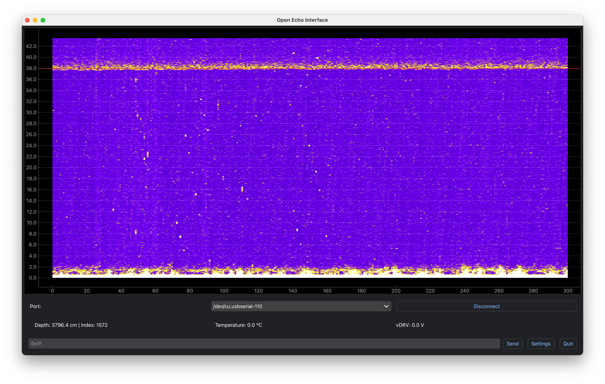
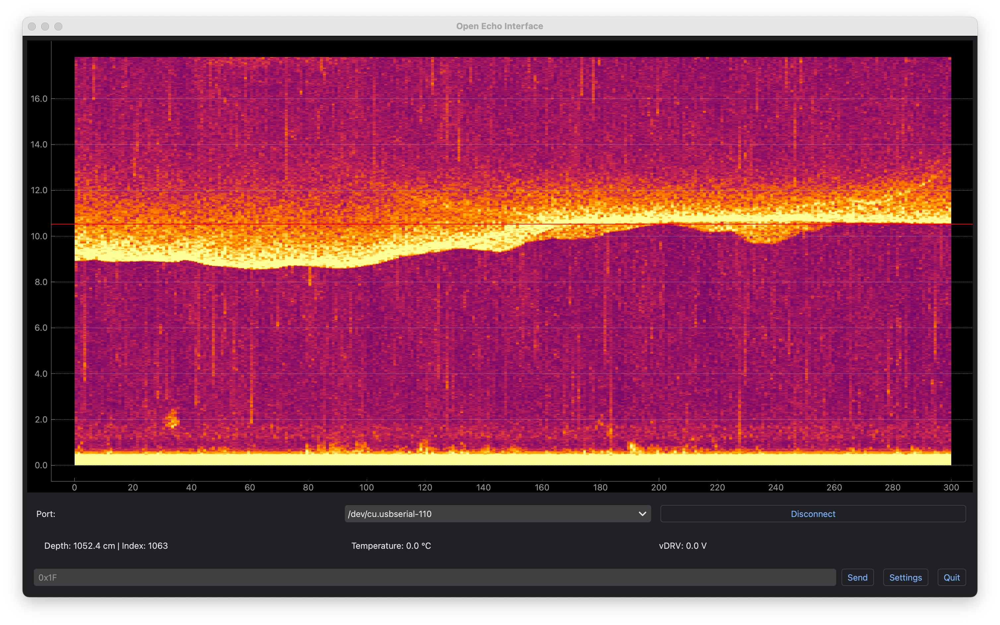
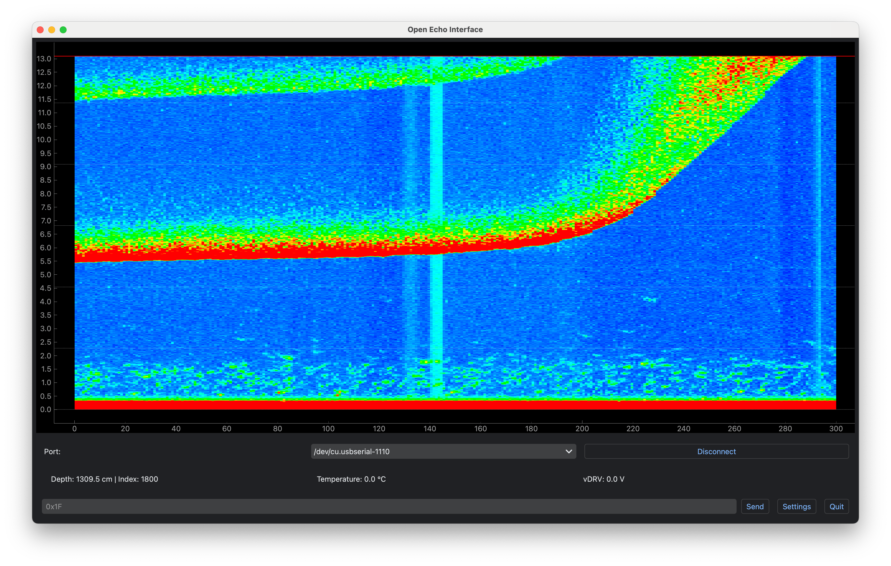
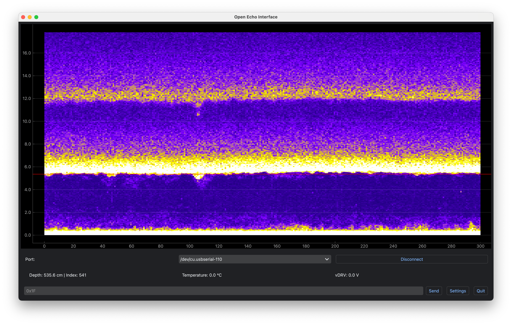
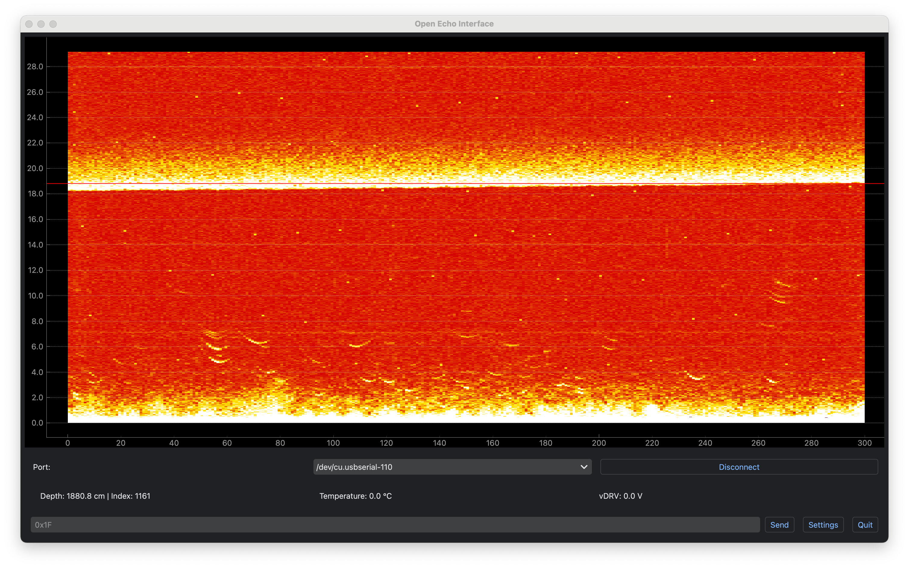
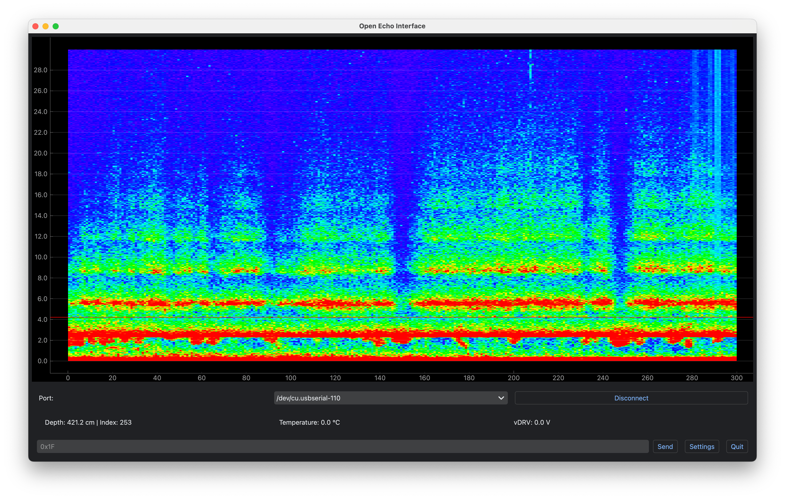

## Universal Open-Source SONAR Controller and Development Stack

An ongoing open-source hardware and software project for building sonar systems for testing, boating, bathymetry, and research.  
The most commonly used hardware is the [TUSS4470 Arduino Shield](TUSS4470_shield_002/), which stacks on top of an Arduino Uno to drive the TUSS4470 ultrasonic driver.  
The board can run the [RAW Data Firmware](TUSS4470_shield_002/getting_started_TUSS4470_firmware.md) to operate a wide variety of ultrasonic transducers, covering frequencies from 40 kHz up to 1000 kHz in different media such as air or water.  

The [NMEA Output Firmware](TUSS4470_shield_002/arduino/NMEA_DBT_OUT/NMEA_DBT_OUT.ino) can read depth data from commercially available in-water ultrasonic transducers (e.g., on boats) and output NMEA0183-compatible data to a computer or a UART-connected device such as a Pixhawk or other controllers.  

Open Echo has been tested on multiple ultrasonic transducers and is compatible with all of them—from car parking sensors to Lowrance Tripleshot side-scan transducers.  

The [Python Interface Software](TUSS4470_shield_002/getting_started_interface.md) connects to Open Echo boards running the [RAW Data Firmware](TUSS4470_shield_002/getting_started_TUSS4470_firmware.md). It can display raw echo data, change configurations, output a TCP depth data stream, and more.  

Check the [Getting Started Guide](TUSS4470_shield_002/README.md)!  

If something is unclear or you find a bug, please open an issue.  

If you need the hardware, you can order it using the [Hardware Files](TUSS4470_shield_002/TUSS4470_shield_hardware/TUSS4470_shield) from a board + SMT house ([JLC recommended](https://jlcpcb.com/?from=Neumi)), or send me a DM on the Discord server, or send an email to: openechoes@gmail.com 
One board is 50€ + shipping.

[TUSS4470 Arduino Shield](TUSS4470_shield_002/):  

### This project is currently in development. The [TUSS4470 Development Shield](TUSS4470_shield_002/) is ready for external use!  
Development is ongoing—check the documentation and Discord channel for the latest updates.  

Want to stay updated or participate? Join the [Discord](https://discord.com/invite/rerCyqAcrw)!  

Check the [Getting Started Guide](TUSS4470_shield_002/README.md).  

--------
## Current State
- Universal TUSS4470-based Arduino shield for testing ultrasonic transducers  
- Python interface software for raw data visualization, configuration, and TCP data output  
- Tested depth range of at least 50 m in water  
- NMEA0183 compatible (DBT data output to other devices)  
- New all-in-one boards with STM32, TUSS4470, and boost converter currently in development  

--------
## Progress

The new (May 2025) [TUSS4470 Arduino Shield](TUSS4470_shield_002/) supports transducers from 40 kHz to 1000 kHz. It can drive them, receive echoes, filter signals, and send raw echo data to the Python backend.  
Driver voltage can be supplied from Arduino VIN or via the external XT30 connector. With an MT3608 boost converter, USB can be used as a power supply and boosted to the desired drive voltage (manual soldering required).  

The [TUSS4470 Arduino Shield](TUSS4470_shield_002/) is and will remain the main development board for this project. It is an excellent platform for testing and development.  
It can drive a wide range of transducers at different voltages, but it is limited by RAM size and sampling speed. You can capture 1800 samples at 12 microseconds per sample (~18 m range in water) with 8-bit resolution. For longer ranges, you can add a delay to capture echoes from more distant objects.  
This makes it a perfect board for learning, testing, and prototyping. Most software development is done using this board.  

For special use cases, additional boards are under development.  
Some use STM32 + TUSS4470, some include additional data outputs, some have a boost transformer stage between the TUSS4470 and the transducer, and others are purely experimental.  
Check the [development](development) folder.  

--------
## Open Echo Interface Software

Firmware examples are available in each project folder.  
The [**Open Echo Interface Software**](TUSS4470_shield_002/echo_interface.py) allows you to control Open Echo boards, view live data, and adjust board settings.  

Live echogram in water on Python software (6x speed):  

## Test results Baltic Sea
Tested using a built-in 150 kHz SEAFARER transducer, powered at 15-20 V via an MT3608 boost converter from USB. In the plots, data capture begins at the bottom.

<table>
  <tr>
    <td align="center">
       
      <b>38 m range test</b>
    </td>
    <td align="center">
       
      <b>Kiel Channel sand and mud</b>
    </td>
    <td align="center">
       
      <b>Slope near Stollergrund</b>
    </td>
  </tr>
  <tr>
    <td align="center">
       
      <b>Stones and sandy seabed</b>
    </td>
    <td align="center">
       
      <b>Fish detection</b>
    </td>
    <td align="center">
       
      <b>Multiple reflections and seaweed</b>
    </td>
  </tr>
  
</table>

## Videos

https://www.youtube.com/watch?v=R3_NO2F7PsI  
https://www.youtube.com/watch?v=msbLVsY8xhQ  
https://www.youtube.com/watch?v=eJ8jVEQSx_Y  
https://www.youtube.com/watch?v=Bxh3rWd5RZk  
https://www.youtube.com/watch?v=UDYWQIizN7A  

## Useful Links
https://www.rapp-instruments.de/RemoteSensing/Roves/sidescan/sidescan.htm  
https://www.youtube.com/watch?v=ZtUkt8Q4EJE  

## Shopping List

**Transducers:**  
- Best price/performance: https://www.alibaba.com/product-detail/Range-customization-lakes-river-surveys-no_1600829423846.html  
- OK for air, 200 kHz: https://de.aliexpress.com/item/1005006007865920.html  
- Very small PZT only: https://de.aliexpress.com/item/1005007032482539.html  
- Not fully tested: https://de.aliexpress.com/item/4000389134890.html  
- Great for air, also works in water, 40 kHz: https://de.aliexpress.com/item/1005006546490802.html
- Cheap and works great in Air for 20cm, water not tested: https://de.aliexpress.com/item/32818381566.html

**Transformers (to step up transducer voltage):**  
https://de.aliexpress.com/item/1005003733606845.html  

**Matching capacitors:**  
https://de.aliexpress.com/item/1005007159862392.html  

**Lucky Fishfinder:**  
https://de.aliexpress.com/item/32711659077.html  

## Big Thanks for Your Support!
www.kogger.tech
