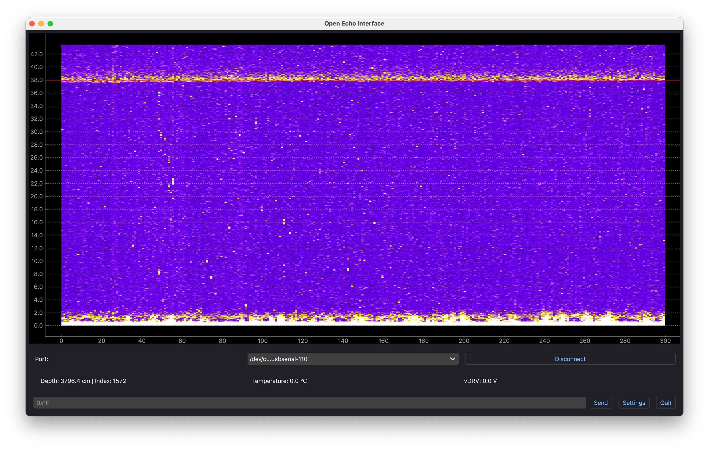
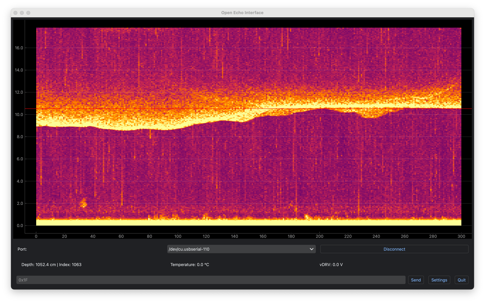
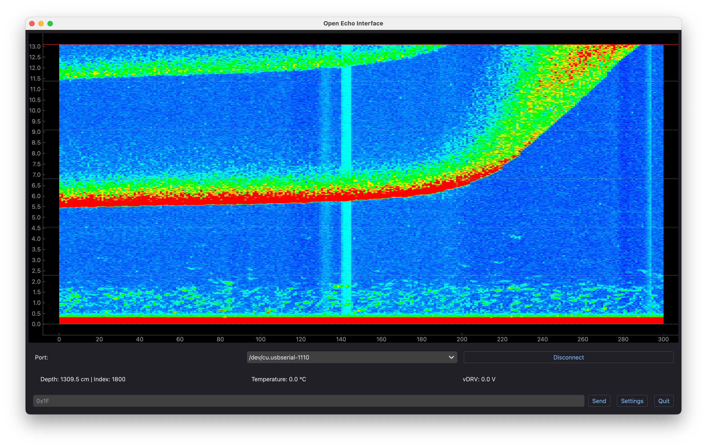
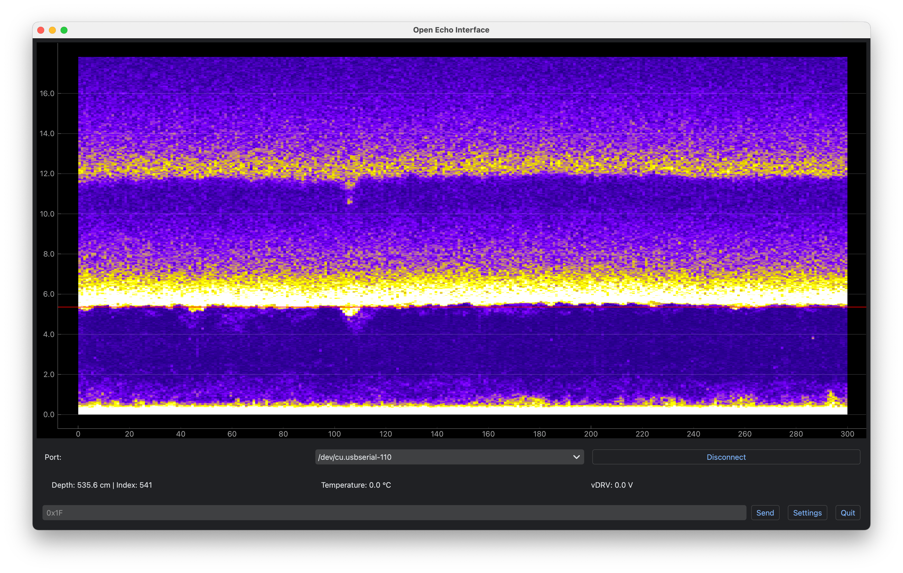
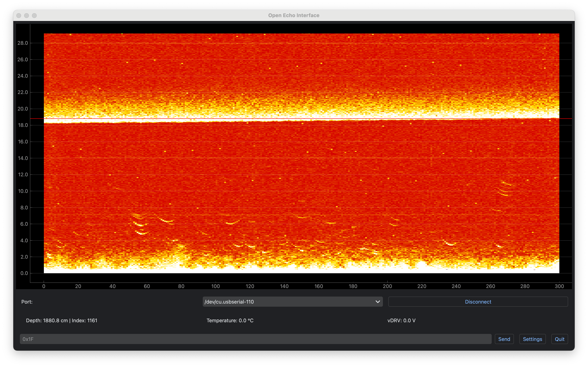
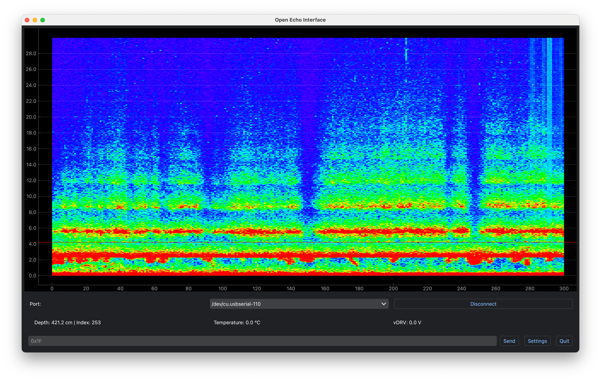

<br>

<div align="center">
  
</div>

## Universal Open-Source SONAR Controller and Development Stack

An ongoing open-source hardware and software project for building sonar systems for testing, boating, bathymetry, and research.

[Discord](https://discord.com/invite/rerCyqAcrw) | [Getting Started Guide](TUSS4470_shield_002/README.md) | [Hardware Files](TUSS4470_shield_002/TUSS4470_shield_hardware/TUSS4470_shield)

## Overview

Open Echo makes SONAR technology accessible for developers, researchers, and hobbyists. It supports a wide variety of commercial and DIY ultrasonic transducers in both water and air, covering frequencies from 40 kHz up to 1000 kHz.

Use cases range from reverse-engineering car parking sensors and reading depth data on a yacht, to operating a Lowrance Tripleshot side-scan transducer or streaming data to a Pixhawk on a custom boat.

### Key Features

* **Universal Transducer Support:** Works with commercial and DIY transducers in water and air.
* **Flexible Firmware:** Run the [RAW Data Firmware](TUSS4470_shield_002/getting_started_TUSS4470_firmware.md) to process echoes yourself, or the [NMEA Output Firmware](TUSS4470_shield_002/arduino/NMEA_DBT_OUT/NMEA_DBT_OUT.ino) for NMEA0183 DBT compatibility (sends depth data directly to PCs, Pixhawk, or marine controllers).
* **Python Interface:** The [desktop software](TUSS4470_shield_002/getting_started_interface.md) provides live raw data visualization and TCP data streaming.
* **Tested Range:** Confirmed depth tracking of >50 m in water.
* **Network Ready:** Includes a PicoW implementation (software only, the shield itself is Arduino UNO R3 compatible) that transfers RAW data over UDP directly to the Python interface.

## Hardware & Getting Started

The primary development platform is the [TUSS4470 Arduino Shield](TUSS4470_shield_002/). It stacks directly on top of an Arduino Uno to drive the TUSS4470 ultrasonic driver.

**Upcoming Board:** A new development version is in the works and will hopefully be released in the coming weeks. It features an on-board boost converter and slightly improved signal routing.

* **Powering (Current Board):** Provide driver voltage via Arduino VIN or the external XT30 connector. You can also currently use an MT3608 boost converter to step up USB power to your required drive voltage (requires manual soldering until the new board is released).
* **Capabilities:** Drives transducers from 40–1000 kHz, filters signals, and sends raw echo data to the backend. It captures 1800 samples at 13.2 µs/sample (roughly an 18m range in water at 8-bit resolution). You can manually add delays in the code to extend the detection range for further distances.

### Getting the Hardware

1. **Elecrow (Pre-Built):** Buy a fully assembled and tested board here: [Elecrow Open Echo TUSS4470](https://www.elecrow.com/open-echo-tuss4470-development-shield.html)
2. **Build Your Own:** Order the [Hardware Files](TUSS4470_shield_002/TUSS4470_shield_hardware/TUSS4470_shield) from your preferred PCB manufacturer (JLCPCB recommended).
3. **Directly from me (Germany/EU):** If Elecrow is out of stock or you want to reduce shipping costs within Germany, email me at: `openechoes@gmail.com`.

> **Note:** All profits go directly toward supporting the project. Please understand that I can only provide support if you order the boards directly from me or Elecrow.

## Open Echo Interface Software

The [Python Interface Software](TUSS4470_shield_002/echo_interface.py) connects to boards running the RAW Data Firmware. It serves as a simple backend to view live echograms and output TCP depth data streams. (Configuration tweaking directly from the UI will be added later).

Live echogram in water (6x speed):  


*(Static raw data waterfall chart available [here](documentation/images/echo_software_screenshot.jpg))*

## Test Results: Baltic Sea

Tested using a built-in 150 kHz SEAFARER transducer, powered at 15-20 V via an MT3608 boost converter from USB. Data capture in the plots begins at the bottom.

<table>
  <tr>
    <td align="center">
      <br/>
      <sub><b>38 m range test</b></sub>
    </td>
    <td align="center">
      <br/>
      <sub><b>Kiel Channel sand and mud</b></sub>
    </td>
    <td align="center">
      <br/>
      <sub><b>Slope near Stollergrund</b></sub>
    </td>
  </tr>
  <tr>
    <td align="center">
      <br/>
      <sub><b>Stones and sandy seabed</b></sub>
    </td>
    <td align="center">
      <br/>
      <sub><b>Fish detection</b></sub>
    </td>
    <td align="center">
      <br/>
      <sub><b>Multiple reflections and seaweed</b></sub>
    </td>
  </tr>
</table>

## Transducers

Open Echo has been tested with multiple transducers. Here is a curated list of tested hardware:

| Transducer Name | Rating | Description | Freq. | Range Air/Water | Price | Link |
| --- | --- | --- | --- | --- | --- | --- |
| NASA / Seafarer 150kHz | ⭐⭐⭐ | NASA in-hull boat transducer for echo sounding / fish-finding | 150kHz | >2m / >50m | 50-100€ | [Link](https://www.nasamarine.com/product/depth-transducer-with-7-metre-cable/7) |
| Raymarine CPT-S | ⭐⭐⭐ | High-quality in-hull transducer with two frequencies | 50/200kHz | 2m / >50m | 200€ | [Link](https://www.raymarine.com/de-de/unsere-produkte/fischfinder-und-sonarmodule/fischfindergeber/cpt-s-durchbruchgeber) |
| Lowrance Tripleshot | ⭐⭐⭐ | Sidescan transducer (three FANS + temp + down-scan) | 200/455/600kHz | 0m / >20m | 200€ | [Link](https://www.echolotzentrum.de/shop/lowrance-tripleshot-heckgeber/) |
| Cheap Bathymetry | ⭐⭐⭐ | Good range and price/performance (can be hard to order) | 200kHz | 2m / >30m | 25€ | [Link](https://www.alibaba.com/product-detail/Range-customization-lakes-river-surveys-no_1600829423846.html) |
| Car Parking Sensor | ⭐⭐ | Great for air, works in water (not recommended for marine) | 40kHz | >7m / >30m | 5€ | [Link](https://de.aliexpress.com/item/1005006546490802.html) |
| Water Flow Sensor | ⭐⭐ | Cheap (Air & Water). Very narrow beam in water (~5°)! | 1000kHz | 0.25m / >10m | 16€ (5pcs) | [Link](https://de.aliexpress.com/item/32818381566.html) |
| Sinter Glass (Air Only) | ⭐ | Sinter glass matching layer, strictly for air use | 200kHz | 0.8m / (>8m) | 10€ | [Link](https://de.aliexpress.com/item/1005006007865920.html) |
| Encapsulated Transducers | ⭐ | Good for short-range testing at higher frequencies | 200-400kHz | ?m / ?m | 9-18€ | [Link](https://de.aliexpress.com/item/4000389134890.html) |
| Small PZT Only | ⭐ | Bare component, only for raw experimentation | 200kHz | 0.2m / ?m | 10€ | [Link](https://de.aliexpress.com/item/1005007032482539.html) |

> **Note:** The range values were measured using the TUSS4470 shield on an Arduino Uno with an MT3608 boost converter set to 20V for `vDRV`. Consider them approximate.

> **Tip:** Lower frequencies propagate farther, while higher frequencies produce narrower beams and more detailed echoes. For bathymetry, the first four options work best. Most commercial marine-grade transducers are suitable as long as they operate between 40 and 1000 kHz.

## Media & Resources

### Videos

[](https://www.youtube.com/watch?v=XF7rNGt6UYA)

https://www.youtube.com/watch?v=R3_NO2F7PsI  
https://www.youtube.com/watch?v=msbLVsY8xhQ  
https://www.youtube.com/watch?v=eJ8jVEQSx_Y  
https://www.youtube.com/watch?v=Bxh3rWd5RZk  
https://www.youtube.com/watch?v=UDYWQIizN7A  

### Links

* [Rapp Instruments: Side-Scan Sonar Info](https://www.rapp-instruments.de/RemoteSensing/Roves/sidescan/sidescan.htm)
* [Related Sonar Explanation Video](https://www.youtube.com/watch?v=ZtUkt8Q4EJE)

## Acknowledgments & Support

A big thanks to **[www.kogger.tech](http://www.kogger.tech)** for their continued support!

Thanks to our contributors:
* Check out the [Cheap Yellow Display Implementation](https://github.com/matztam/open_echo_cyd_display) by @matztam.
* Thanks to [@JohnCHarrington](https://github.com/JohnCHarrington/open_echo) for the firmware and software contributions.

### Star History
[](https://www.star-history.com/#Neumi/open_echo&type=date&legend=top-left)

## Citation

If you use `open_echo` in your work or research, please cite the project:

* **ORCID:** [](https://orcid.org/0009-0003-9829-8959) [0009-0003-9829-8959](https://orcid.org/0009-0003-9829-8959)

**BibTeX:**

```bibtex
@misc{open_echo,
  author       = {Jan Neumann},
  title        = {open\_echo},
  year         = {2026},
  publisher    = {GitHub},
  journal      = {GitHub Repository},
  howpublished = {\url{[https://github.com/Neumi/open_echo](https://github.com/Neumi/open_echo)}},
  note         = {ORCID: [https://orcid.org/0009-0003-9829-8959](https://orcid.org/0009-0003-9829-8959)}
}
